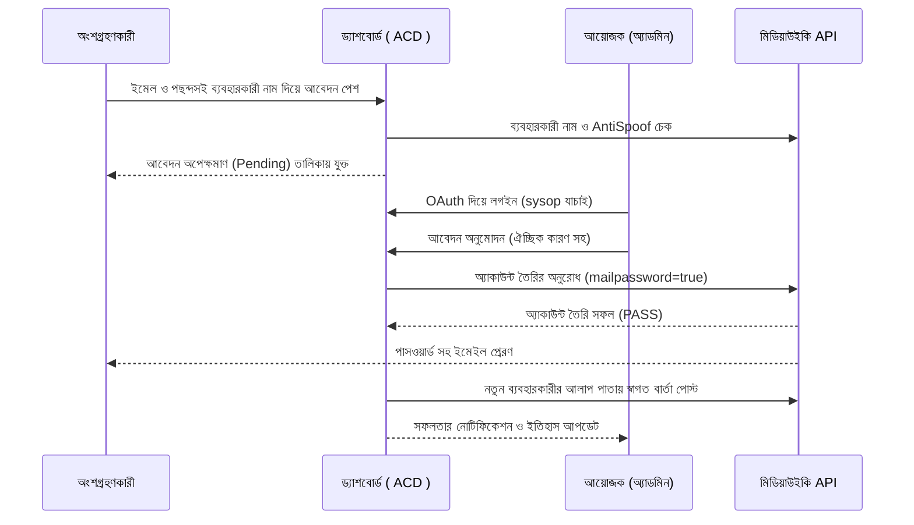

# অ্যাকাউন্ট তৈরির ড্যাশবোর্ড (Account Creation Dashboard)

**অ্যাকাউন্ট তৈরির ড্যাশবোর্ড** (`acd.toolforge.org`) হলো উইকিমিডিয়া আউটরিচ ইভেন্ট, কর্মশালা (workshop), এবং এডিটাথনের আয়োজকদের জন্য ডিজাইন করা একটি চমৎকার ও প্রিমিয়াম ওয়েব অ্যাপ্লিকেশন। এর সাহায্যে আয়োজকরা খুব সহজে এবং দ্রুত অংশগ্রহণকারীদের জন্য নতুন উইকিপিডিয়া অ্যাকাউন্ট তৈরি করে দিতে পারেন।

---

## কেন এই টুলটি তৈরি করা হয়েছে? (Why it was created)

### ১. আইপি সীমাবদ্ধতার সমস্যা (The IP Limit Problem)
উইকিপিডিয়ার সাধারণ নিয়ম অনুযায়ী, একটি নির্দিষ্ট আইপি (IP address) থেকে ২৪ ঘণ্টায় সর্বোচ্চ ৬টি অ্যাকাউন্ট তৈরি করা যায়। কর্মশালা বা এডিটাথনের মতো বাস্তব ইভেন্টগুলিতে যখন অনেক অংশগ্রহণকারী এক জায়গায় জড়ো হয়ে একই ওয়াইফাই বা ইন্টারনেট নেটওয়ার্ক ব্যবহার করে নতুন অ্যাকাউন্ট খোলার চেষ্টা করেন, তখন তারা এই সীমাবদ্ধতার সম্মুখীন হন এবং অ্যাকাউন্ট তৈরি করতে পারেন না।

### ২. অন্যান্য টুলের সীমাবদ্ধতা (Limitations of Other Tools)
*   **আউটরিচ ড্যাশবোর্ড (Outreach Dashboard):** এটি স্বয়ংক্রিয় অ্যাকাউন্ট তৈরির সুবিধা দেয় ঠিকই, কিন্তু এর মাধ্যমে অ্যাকাউন্টগুলি প্রধানত ইংরেজি উইকিপিডিয়া (`enwiki`)-এর মাধ্যমে তৈরি হয়, যা পরিচালনার জন্য ইংরেজি উইকিপিডিয়াতে বিশেষ প্রশাসক বা অ্যাকাউন্ট ক্রিয়েটর অনুমতির প্রয়োজন হয় এবং স্থানীয় আয়োজকদের জন্য তা জটিল হয়ে দাঁড়ায়।
*   **accounts.wmflabs.org (বা accounts.wmcloud.org):** এই টুলটি অ্যাকাউন্ট তৈরি করতে পারে, কিন্তু এটি ব্যবহার করার জন্য ব্যবহারকারীকে অন্য স্তরের বিশ্বস্ততা প্রমাণ করতে হয়—যেমন ইংরেজি উইকিপিডিয়াতে ভালো অবদান (contributions) থাকতে হয় এবং টুলটিতে প্রবেশাধিকার পাওয়ার জন্য বিশেষ আবেদন ও অনুমোদন প্রক্রিয়া পার হতে হয়।

### ৩. এই টুলের মাধ্যমে সমাধান (The Solution)
আমাদের এই ড্যাশবোর্ডটি উক্ত সমস্যাগুলির সহজ এবং স্থানীয় সমাধান দেয়। যে সকল উইকিপিডিয়ানরা স্থানীয় উইকিপিডিয়ায় (যেমন বাংলা উইকিপিডিয়া বা উইকিমিডিয়া বাংলাদেশ) প্রশাসক (sysop) হিসেবে রয়েছেন, তারা উইকিমিডিয়া মেটাতে কোনো বিশেষ বা অতিরিক্ত বৈশ্বিক অনুমতি ছাড়াই সরাসরি তাদের বিদ্যমান প্রশাসক অ্যাকাউন্টের মাধ্যমে OAuth দিয়ে এই টুলে লগইন করতে পারেন এবং ইভেন্টের সাধারণ অংশগ্রহণকারীদের জন্য সরাসরি সরাসরি উইকিপিডিয়ার গ্লোবাল অ্যাকাউন্ট (SUL) তৈরি ও অনুমোদন করতে পারেন।

---

## মূল বৈশিষ্ট্যসমূহ (Key Features)

*   **OAuth 2.0 লগইন ও অ্যাডমিন রোল যাচাইকরণ:** উইকিপিডিয়ার অফিসিয়াল OAuth ২.০ ব্যবহার করে নিরাপদ লগইন। লগইন করার পর সিস্টেম স্বয়ংক্রিয়ভাবে যাচাই করে ব্যবহারকারী `bn.wikipedia.org` অথবা `bd.wikimedia.org`-এর প্রশাসক (sysop) কি না।
*   **রিয়েল-টাইম ব্যবহারকারী নাম ও অ্যান্টি-স্পুফ পরীক্ষা:** ব্যবহারকারী যখন আবেদন ফর্মে তার নাম লিখবেন, তখন ব্যাকএন্ডের মাধ্যমে রিয়েল-টাইমে গ্লোবাল নেটওয়ার্কে (SUL) নামটি ইতিমধ্যে আছে কি না এবং AntiSpoof এক্সটেনশন অনুযায়ী কোনো সংঘাত (conflict) তৈরি করছে কি না তা পরীক্ষা করা হয়।
*   **স্বয়ংক্রিয় ডাইনামিক উইকি টার্গেট:** অ্যাডমিন যে উইকির প্রশাসক, অ্যাকাউন্ট তৈরির আবেদনটি অনুমোদন করার পর অ্যাকাউন্টটি সেই নির্দিষ্ট উইকিতেই তৈরি হবে (যেমন উইকিমিডিয়া বাংলাদেশ বা বাংলা উইকিপিডিয়া)।
*   **সাময়িক পাসওয়ার্ড ইমেইলে প্রেরণ:** অ্যাকাউন্ট তৈরির সময় `mailpassword: 'true'` মোড ব্যবহার করায় ব্যবহারকারীর ইমেইলে একটি স্বয়ংক্রিয় সাময়িক পাসওয়ার্ড চলে যায়, ফলে অ্যাডমিনকে নিজে পাসওয়ার্ড তৈরি করতে বা দেখতে হয় না।
*   **স্বয়ংক্রিয় স্বাগত বার্তা প্রদান (Talk Page Welcome Message):** অ্যাকাউন্টটি সফলভাবে তৈরি হওয়ার পর প্রশাসকের অ্যাকাউন্টের মাধ্যমে স্বয়ংক্রিয়ভাবে নতুন ব্যবহারকারীর আলাপ পাতায় (Talk Page) একটি সুন্দর স্বাগত বার্তা পোস্ট করা হয়, যা অ্যাডমিন সেটিংস থেকে কাস্টমাইজ করা যায়।
*   **ঐচ্ছিক অনুমোদন ও বাতিলের মন্তব্য (Decision Reason):** প্রতিটি আবেদন অনুমোদন বা বাতিলের সময় অ্যাডমিন চাইলে ঐচ্ছিক মন্তব্য যুক্ত করতে পারেন, যা উইকিপিডিয়ার ক্রিয়েশন সামারিতে এবং ড্যাশবোর্ড লগে যুক্ত হয়।
*   **বিস্তারিত ত্রুটি প্রদর্শন (Detailed API Error Logs):** উইকিপিডিয়া API থেকে অ্যাকাউন্ট তৈরিতে কোনো সমস্যা হলে (যেমন নাম ব্লক বা আইপি ব্লক), সুনির্দিষ্ট ত্রুটি বার্তাটি সরাসরি ড্যাশবোর্ডে অ্যাডমিনকে দেখায়।
*   **ইভেন্ট সেটিংস ও ডাটা ডাউনলোড:** যেকোনো সময় ইভেন্টের নাম পরিবর্তন, অতিরিক্ত নির্দেশনা সেট করা, রেজিস্ট্রেশন বন্ধ/চালু করা এবং সম্পূর্ণ লগের ডেটা CSV ফাইল আকারে ডাউনলোড করার সুবিধা।

---

## এটি কীভাবে কাজ করে? (How it Works)

---

## কীভাবে ব্যবহার করবেন? (How to Use)

### ১. সাধারণ ব্যবহারকারী বা অংশগ্রহণকারীদের জন্য:
1.  চলমান ইভেন্টের রেজিস্ট্রেশন পেজে যান (যেমন: `acd.toolforge.org`)।
2.  আপনার সঠিক ইমেইল ঠিকানা এবং উইকিপিডিয়ার জন্য একটি পছন্দসই ব্যবহারকারী নাম দিয়ে **"আবেদন জমা দিন"** বাটনে ক্লিক করুন।
3.  আপনার ব্যবহারকারী নাম উপলব্ধ থাকলে আবেদনটি সফলভাবে জমা হবে এবং ড্যাশবোর্ডে অপেক্ষমাণ থাকবে।
4.  প্রশাসক আপনার আবেদনটি অনুমোদন করার সাথে সাথে আপনার ইমেইলে উইকিপিডিয়ার একটি সাময়িক পাসওয়ার্ড চলে যাবে। আপনি সেই পাসওয়ার্ড ব্যবহার করে লগইন করতে পারবেন।

### ২. আয়োজক বা প্রশাসকদের জন্য:
1.  ড্যাশবোর্ডের ডান কোণায় থাকা **"লগইন"** লিংকে ক্লিক করে আপনার উইকিপিডিয়া অ্যাকাউন্ট দিয়ে লগইন করুন এবং অ্যাপ্লিকেশনটিকে অনুমোদন দিন।
2.  লগইন সফল হলে আপনাকে মূল অ্যাডমিন ড্যাশবোর্ডে নিয়ে যাওয়া হবে। সেখানে আপনি অপেক্ষমাণ সকল আবেদন দেখতে পাবেন।
3.  কোনো আবেদন অনুমোদন করতে চাইলে **"তৈরি করুন"** বাটনে ক্লিক করুন। একটি পপআপ আসবে যেখানে আপনি চাইলে কোনো ঐচ্ছিক মন্তব্য লিখতে পারেন, অতঃপর **"নিশ্চিত করুন"** চাপলে উইকিপিডিয়াতে অ্যাকাউন্টটি তৈরি হয়ে যাবে।
4.  কোনো আবেদন বাতিল করতে চাইলে **"বাতিল করুন"** বাটনে ক্লিক করে বাতিলের ঐচ্ছিক কারণ লিখে নিশ্চিত করতে পারেন।
5.  ড্যাশবোর্ডের নিচে থাকা **"পূর্ববর্তী সিদ্ধান্তসমূহ (চলমান ইভেন্ট)"** টেবিল থেকে চলমান ইভেন্টে ইতিমধ্যে নেওয়া সিদ্ধান্ত এবং মন্তব্যসমূহ রিভিউ করতে পারবেন।
6.  **"ইভেন্ট সেটিংস"** ট্যাব থেকে নতুন ইভেন্ট তৈরি করতে পারবেন, রেজিস্ট্রেশন বন্ধ/চালু করতে পারবেন এবং কাস্টম স্বাগত বার্তা ও অতিরিক্ত নির্দেশনা সেট করতে পারবেন।
